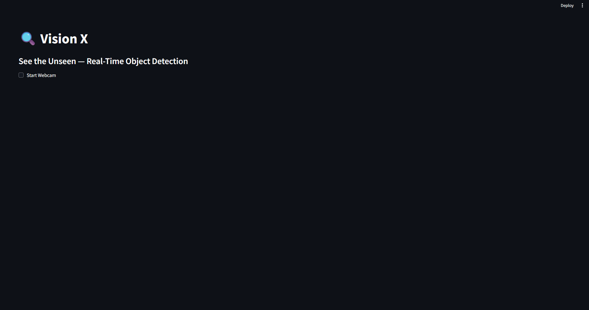

# 👁️ VisionX — Your Intuitive Object Detection Engine


**VisionX** is a powerful and user-friendly object detection engine, built with **Streamlit** and **YOLOv8**. It provides a simple web interface to perform real-time object detection on images and videos, making advanced computer vision accessible to everyone.

---

## 🌐 Live Demo

👉 [**View Live Demo**](https://visionx.streamlit.app)

---

## 🔥 Features

- 📸 **Real Time Detection**: Detects objects in real time.
- 🎥 **Video Analysis**: Analyze video streams for real-time object detection.
- ⚙️ **Customizable Confidence**: Adjust detection confidence thresholds.
- ⚡ **Fast Inference**: Leverages YOLOv8 for efficient and rapid detection.
- 🚀 **Streamlit Interface**: Intuitive and interactive web application.
- 📦 **Pre-trained Models**: Comes with `yolov8n.pt` for out-of-the-box detection.

---

## 📸 Project Screenshots

| Object Detection in Action |
|----------------------------|
|  |

---

## 🧠 How it Works

- Users upload an image or video file through the Streamlit interface.
- The uploaded media is processed by the YOLOv8 model.
- Detected objects are highlighted with bounding boxes and labels.
- The results are displayed back to the user in real-time.

---

## 🛠️ Tech Stack

- **Framework**: Streamlit (Python)
- **Model**: YOLOv8 (PyTorch, Ultralytics)
- **Computer Vision**: OpenCV
- **Core Logic**: Python

---

## 🚀 Getting Started

# To run VisionX locally, follow these steps:

```bash
git clone https://github.com/khanfaisal79960/VisionX.git
cd VisionX
python -m venv venv
source venv/bin/activate  # or .\venv\Scripts\activate on Windows
pip install -r requirements.txt
streamlit run app.py

```

Now open your browser and visit the address provided by Streamlit (usually http://localhost:8501).

📁 Project Structure

```

VisionX/
├── app.py
├── requirements.txt
├── yolov8n.pt
├── README.md
├── assets/
    └── screenshot_1.png
    └── cover_image.png

```

## 🙋‍♂️ Author

**Faisal Khan**

- 🌐 [Portfolio](https://khanfaisal.netlify.app)
- 💼 [LinkedIn](https://www.linkedin.com/in/khanfaisal79960)
- ✍️ [Medium](https://medium.com/@khanfaisal79960)
- 📸 [Instagram](https://instagram.com/mr._perfect_1004)
- 💻 [GitHub](https://github.com/khanfaisal79960)


---